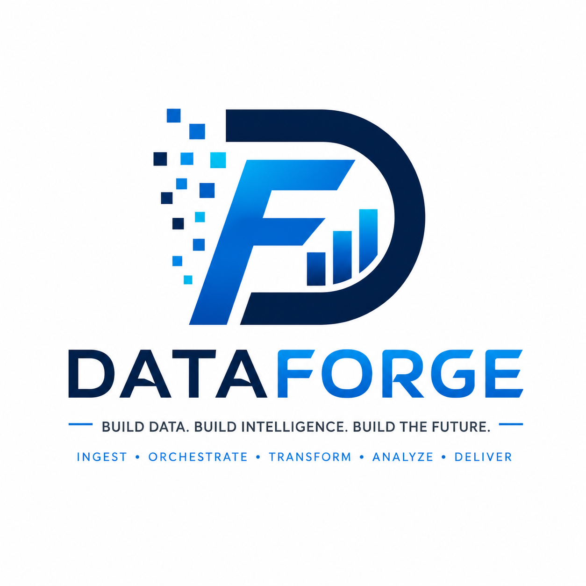

<p align="center">
  
</p>

<h1 align="center">DataForge</h1>

<p align="center">
  <strong>Build Data. Build Intelligence. Build the Future.</strong>
</p>

<p align="center">
  An open, modular, enterprise-grade data engineering platform for building scalable, production-ready data solutions.
</p>

<p align="center">


</p>

---

# 🚀 Overview

DataForge is a modular, enterprise-grade data engineering platform designed to simplify how organizations ingest, orchestrate, transform, monitor, govern, and serve data from virtually any source.

Built using modern engineering principles, DataForge provides a scalable foundation for building production-ready data platforms across banking, healthcare, mining, agriculture, retail, manufacturing, logistics, telecommunications, insurance, hospitality, and government.

DataForge is being engineered as both a real-world learning platform and a production-quality open-source project that demonstrates modern data engineering best practices.

---

# 🎯 Vision

To become the leading open-source enterprise data engineering platform that empowers organizations to build scalable, reliable, and intelligent data ecosystems.

---

# 🎯 Mission

To simplify enterprise data engineering by providing a modular, production-ready platform that integrates diverse data sources, automates workflows, enforces data quality, and delivers trusted data for analytics and intelligent decision-making.

---

# ✨ Core Features

* Modular connector framework
* Enterprise ETL & ELT pipelines
* Workflow orchestration
* Batch processing
* Streaming data pipelines
* Bronze • Silver • Gold architecture
* Data quality validation
* Metadata management
* Monitoring & observability
* REST APIs
* Containerized deployment
* CI/CD integration
* Cloud-ready architecture

---

# 🏗 High-Level Architecture

```text
                    DATA SOURCES

APIs | Databases | ERP | CRM | CSV | Excel | IoT | Kafka

                         │
                         ▼

              DataForge Connectors

                         │
                         ▼

      Workflow Orchestration (Airflow)

                         │
                         ▼

      Validation & Data Quality Layer

                         │
                         ▼

         Bronze • Silver • Gold Storage

                         │
                         ▼

      Processing (Python • Spark • dbt)

                         │
                         ▼

     PostgreSQL • MinIO • Apache Kafka

                         │
                         ▼

 Dashboards • REST APIs • Machine Learning
```

---

# 🛠 Technology Stack

| Layer                   | Technology           |
| ----------------------- | -------------------- |
| Programming             | Python               |
| Containers              | Docker               |
| Container Orchestration | Docker Compose       |
| Workflow Orchestration  | Apache Airflow       |
| Database                | PostgreSQL           |
| Object Storage          | MinIO                |
| Distributed Processing  | Apache Spark         |
| Streaming               | Apache Kafka         |
| Analytics Engineering   | dbt                  |
| Data Quality            | Great Expectations   |
| Backend API             | FastAPI              |
| Monitoring              | Prometheus & Grafana |
| Version Control         | Git & GitHub         |
| CI/CD                   | GitHub Actions       |
| Deployment              | Kubernetes (Roadmap) |

---

# 📂 Project Structure

```text
dataforge/
│
├── .github/
├── .vscode/
├── assets/
├── airflow/
├── api/
├── configs/
├── connectors/
├── dags/
├── data/
│   ├── bronze/
│   ├── silver/
│   └── gold/
├── docker/
├── docs/
├── monitoring/
├── notebooks/
├── pipelines/
├── scripts/
├── spark/
├── storage/
├── tests/
├── ui/
├── utils/
│
├── README.md
├── LICENSE
├── docker-compose.yml
└── .gitignore
```

---

# 🗺 Development Roadmap

## Phase 1 — Foundation

* Project initialization
* Repository structure
* Documentation
* Docker development environment
* Engineering standards

## Phase 2 — Infrastructure

* PostgreSQL
* MinIO
* Redis
* Docker networking
* Persistent storage

## Phase 3 — Workflow Orchestration

* Apache Airflow
* DAG development
* Scheduling
* Monitoring
* Retry strategies

## Phase 4 — Data Engineering

* Python ETL pipelines
* Medallion Architecture
* Data validation
* Metadata management

## Phase 5 — Big Data

* Apache Spark
* Apache Kafka
* Streaming pipelines

## Phase 6 — Enterprise Platform

* FastAPI
* Authentication & Authorization
* React Web Application
* Monitoring
* CI/CD
* Kubernetes Deployment

---

# 🚧 Current Status

**Current Version**

```text
v0.1.0
```

**Current Sprint**

* ✅ Project initialization
* ✅ Repository setup
* ✅ Development workspace
* 🚧 Docker foundation

---

# 🤝 Contributing

Contributions are welcome.

Whether you're improving documentation, fixing bugs, implementing connectors, or developing new platform capabilities, every contribution helps DataForge become a stronger and more capable data engineering platform.

Contribution guidelines will be published as the project matures.

---

# 📜 License

This project is licensed under the MIT License.

---

# 🔮 Future Vision

DataForge is designed to evolve beyond a portfolio project into a production-ready enterprise platform.

Future releases aim to include:

* Multi-tenant architecture
* Role-Based Access Control (RBAC)
* Enterprise metadata catalog
* Data lineage
* Data governance
* AI-assisted pipeline generation
* Plugin marketplace
* Industry-specific connector packs
* SaaS deployment
* Cloud-native scalability

---

# 💡 Engineering Principles

DataForge is developed using modern software engineering principles:

* Build for production.
* Design for scalability.
* Keep components modular.
* Document every architectural decision.
* Automate wherever possible.
* Prioritize maintainability over complexity.
* Build once. Scale everywhere.

---

# 📚 Documentation

Comprehensive documentation will be available as the project evolves.

Future documentation will include:

* Architecture
* Installation Guide
* Developer Guide
* Deployment Guide
* API Reference
* Tutorials
* Best Practices

---

<p align="center">
<strong>Build Data. Build Intelligence. Build the Future.</strong>
</p>

<p align="center">
Made with ❤️ by <strong>Tichaona Peter Chiripa</strong>
</p>
